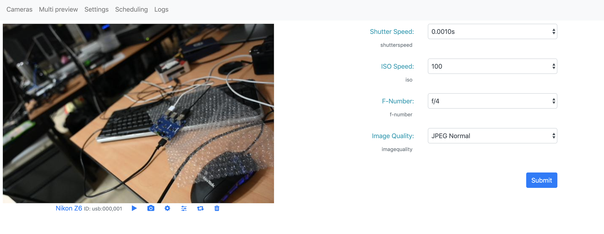
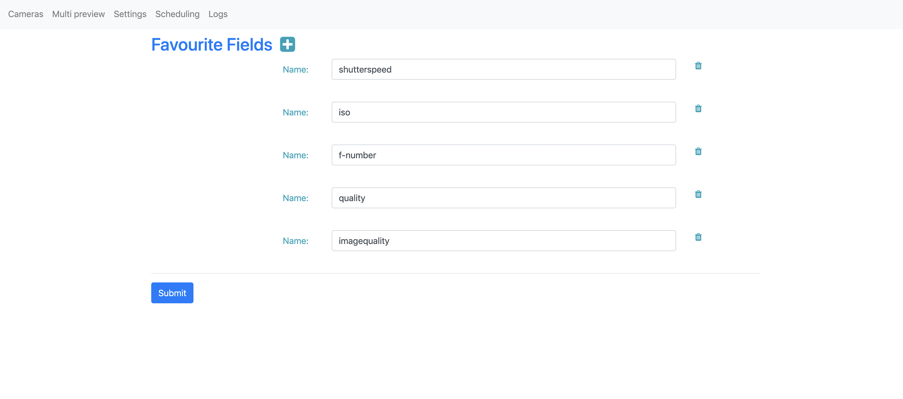

# Camera controller
A web application to control cameras connected through usb.

For supported cameras, please visit [this](http://www.gphoto.org/proj/libgphoto2/support.php) link.

*Was tested on Ubuntu 18.04*

## Main features
- Live preview
- Capture image and download (chrome only for now)
- Change camera settings
- Favourite settings (available in live preview)
- Manage timelapses
- Logs

## Setup
`$ source ./setup.sh` - should setup everything.

`source` - to directly source into the python virtualenv.

Otherwise, it's possible to run `$ source .venv/bin/activate` after `./setup.sh`

### In case setup.sh fails
Requirements:
- python3.7 python3.7-dev
- gphoto2
- *[Yepkit/ykush](https://github.com/Yepkit/ykush.git) (if you want to use ykush3 board)

Install the python packages from `./requiremenets.txt`

## How to run
`$ ./run.sh` - it should start the web app at the port 80.

## Timelapse file transfer
1. Mount the nfs server
2. Watch for any changes in `./Timelapses` and transfer all any files inside to the nfs server

#### Requirements
- nfs-common
- inotify-tools

- **Setup**: `./scripts/setup_timelapse_file_transfer.sh`
- **Run**: `./scripts/run_timelapse_file_transfer.sh`

By default, it will wait for any changes in `./Timelapses` and move the files to `/Mounted/Cern/Timelapse/Software/Timelapses`.

The file transfer will work even if the nfs server was not mounted. It will simply move the files to a different directory.

## Max

Before everything, I would suggest running: `sudo su` to run the below commands as sudo.

#### Setup
This will setup both web app and file transfer.
~~~bash
./setup.sh
~~~

To setup only the web app:
~~~bash
./scripts/setup_web_app.sh
~~~

To setup only the file transfer (install dependencies and mount nfs server):
~~~bash
./scripts/setup_timelapse_file_transfer.sh
~~~

#### Web app
Run the web app in background:
~~~bash
bash -c 'source .venv/bin/activate && ./run.sh 2>&1 1>> out.log &'
~~~

The output will be written in out.log.

If you get an error like: 'The port is already in use', then the server has already been started. To close it, run:
~~~bash
pkill -f runserver # Kill all processes containing 'runserver'
~~~

#### NFS file transfer

Mount the nfs server. It will mount the nfs server to `/Mounted/Cern/`
~~~bash
./scripts/mount_nfs.sh
~~~

To make sure it has been successfully mounted, run a quick check:
~~~bash
ls /Mounted/Cern/
~~~
You should see a list with all the files/directories in the nfs server

To continuously transfer the files, run:
~~~bash
./scripts/run_timelapse_file_transfer.sh 2>&1 1>> sync.log &
~~~

The output will be written in sync.log.

#### Start everything on system boot:
This explains how to automatically start the web app and file transfer at boot.

First, make sure `vim` is installed:
~~~bash
sudo apt update
sudo apt install vim
~~~

Next, add a root cron job:
~~~bash
sudo crontab -e
~~~
Choose `vim` (to edit the crontab file through vim text editor).

Now, at the end of the file, add the following:
~~~
SHELL=/bin/bash
@reboot cd /home/*/CameraController/ && source .venv/bin/activate && ./run.sh 2>&1 1>> ./out.log
@reboot cd /home/*/CameraController/ && ./scripts/run_timelapse_file_transfer.sh 2>&1 1>> sync.log
~~~
Save & exit.

Reboot to see if it works.

#### Autodetect cameras every 5 minutes
Add a cron job (described above). No need for root privileges:
~~~bash
*/5 * * * * curl localhost:80/api/cameras_autodetect
~~~

# Screenshots
**Index:**

**Camera settings:**

**Live preview:**

**Multipreview:**

**Schedule:**

**Timelapse:**

**Settings:**

**Favourite fields settings:**

**Logs:**

