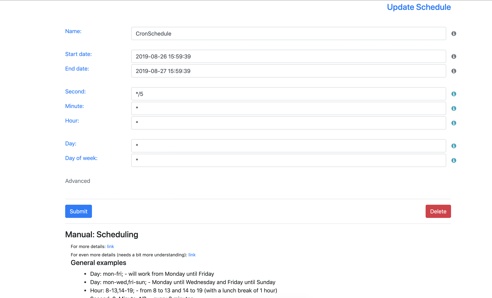
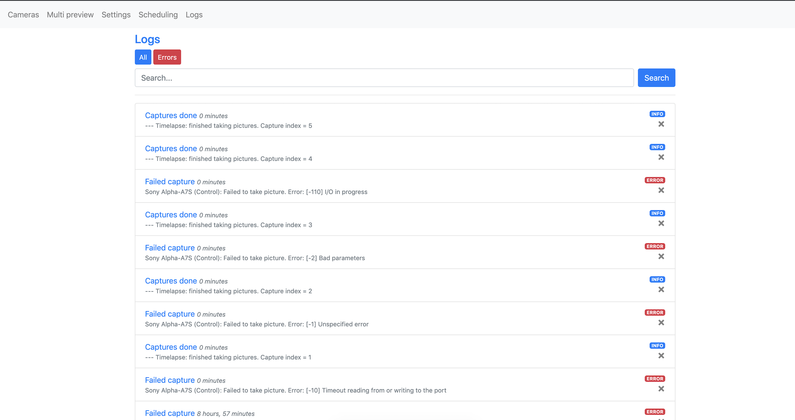

# Camera controller
A web application to control cameras connected through usb.

For supported cameras, please visit [this](http://www.gphoto.org/proj/libgphoto2/support.php) link.

*Was tested on Ubuntu 18.04*

## Main features
- Live preview
- Capture image and download (chrome only for now)
- Change camera settings
- Favorite settings (available in live preview)
- Manage timelapses
- Logs

## Setup
`$ source ./setup.sh` - should setup everything.

`source` - to directly source into the python virtualenv.

Otherwise, it's possible to run `$ source .venv/bin/activate` after `./setup.sh`

### In case setup.sh fails
Requirements:
- python3.7 python3.7-dev
- gphoto2
- [Yepkit/ykush](https://github.com/Yepkit/ykush.git) (if you want to use ykush3 board)

Install the python packages from `./requiremenets.txt`

## How to run
`$ ./run.sh` - it should start the web app at the port 80 (python required)

## Timelapse file transfer
The web app should automatically mount the nfs server and transfer the files to it. `./scripts/configs.sh` contains some settings you may want to tweak.

#### Requirements
`apt install nfs-common inotify-tools`

#### Info
The script used by the web app: `./scripts/run_timelapse_file_transfer.sh`.

By default, it will wait for any changes in `$TIMELAPSE_DIR` and move the files to `"${MOUNT_POINT}/${TIMELAPSE_DEST}"`.

If the nfs server gets disconnected, it will automatically try to mount it again and save any lost files. A lost file - a file that gets transferred to the destination while the server is not mounted, very rare - but possible.

The errors are logged, and it will also send an email about these errors.

## Max

Before everything, I would suggest running: `sudo su` to run the below commands as sudo.
Actually, the root privileges are required only because of ykush.

#### Setup
This will setup both web app and file transfer.
~~~bash
./setup.sh
~~~

#### Web app
Run the web app in background:
~~~bash
bash -c 'source .venv/bin/activate && ./run.sh >> out.log 2>&1 &'
~~~

The output will be written in out.log.

If you get an error like: 'The port is already in use', then the server has already been started. To close it, run:
~~~bash
pkill -f runserver # Kill all processes containing 'runserver'
~~~

#### NFS file transfer
The transfer is now handled by the web app.

#### Start everything on system boot:
This explains how to automatically start the web app at boot.

First, make sure `vim` is installed:
~~~bash
sudo apt update
sudo apt install vim
~~~

Next, add a root cron job:
~~~bash
sudo crontab -e
~~~
Choose `vim` (to edit the crontab file through vim text editor).

Now, at the end of the file, add the following:
~~~
SHELL=/bin/bash
@reboot cd /home/*/CameraController/ && source .venv/bin/activate && ./run.sh 2>&1 1>> ./out.log
~~~
Save & exit (esc -> `:x`)
To edit: `i`

Reboot to see if it works.

#### Autodetect cameras every 10 minutes
Add a cron job (described above). No need for root privileges:
~~~bash
*/10 * * * * curl localhost:80/api/cameras_autodetect
~~~

This will send a request to the web app to autodetect cameras every n minutes.

# Screenshots
**Index:**

**Camera settings:**

**Live preview:**

**Multipreview:**

**Schedule:**

**Timelapse:**

**Settings:**

**Favourite fields settings:**

**Logs:**

