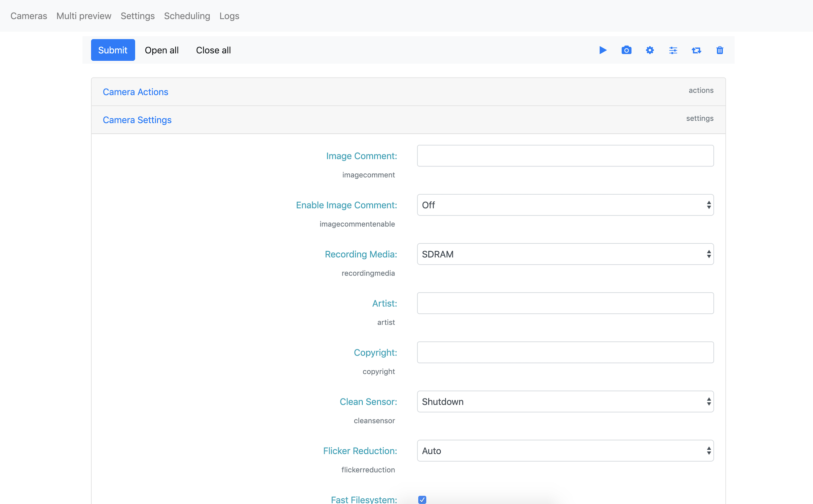
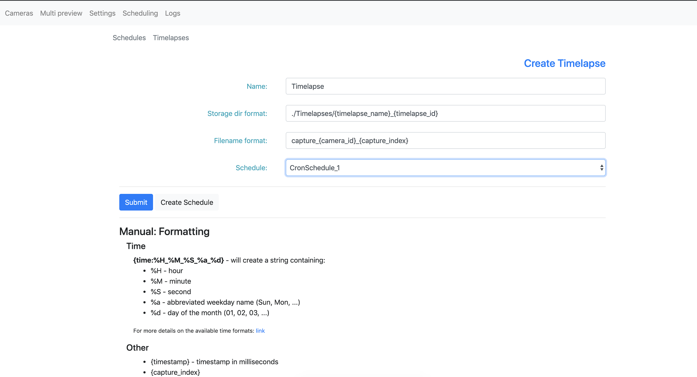

# Camera controller
A web application to control cameras connected through usb.

For supported cameras, please visit [this](http://www.gphoto.org/proj/libgphoto2/support.php) link.

*Was tested on Ubuntu 18.04*

## Main features
- Live preview
- Capture image and download (chrome only for now)
- Change camera settings
- Favourite settings (available in live preview)
- Manage timelapses
- Logs

## Setup
`$ source ./setup.sh` - should setup everything.

`source` - to directly source into the python virtualenv.

Otherwise, it's possible to run `$ source .venv/bin/activate` after `./setup.sh`

### In case setup.sh fails
Requirements:
- python3.7 python3.7-dev
- gphoto2
- *[Yepkit/ykush](https://github.com/Yepkit/ykush.git) (if you want to use ykush3 board)

Install the python packages from `./requiremenets.txt`

## How to run
`$ ./run.sh` - it should start the web app at the port 5000.

## Timelapse file transfer
1. Mount the nfs server
2. Watch for any changes in `./Timelapses` and transfer all any files inside to the nfs server

#### Requirements
- nfs-common
- inotify-tools

- **Setup**: `./scripts/setup_timelapse_file_transfer.sh`
- **Run**: `./scripts/run_timelapse_file_transfer.sh`

By default, it will wait for any changes in `./Timelapses` and move the files to `/Mounted/Cern/Timelapse/Software/Timelapses`.

The file transfer will work even if the nfs server was not mounted. It will simply move the files to a different directory.

# Screenshots
**Index:**

**Camera settings:**

**Live preview:**

**Multipreview:**

**Schedule:**

**Timelapse:**

**Settings:**

**Favourite fields settings:**

**Logs:**

